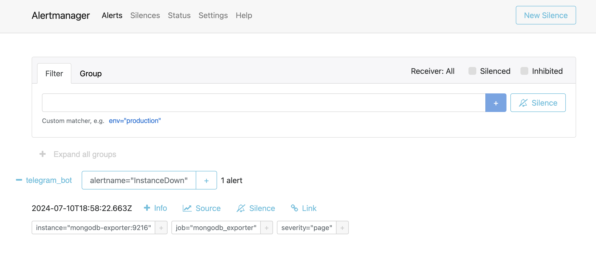
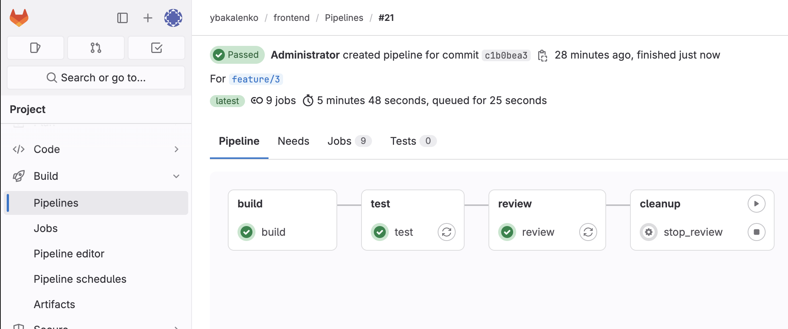

# О приложении
**IceCube** — нейтринная обсерватория, построенная на антарктической станции Амундсен-Скотт.
IceCube расположен глубоко в толще антарктического льда. На глубине от 1450 до 2450 м помещены прочные «нити»
с прикреплёнными оптическими детекторами (фотоумножителями). Каждая «нить» имеет 60 фотоумножителей - всего
5160 сенсоров. Оптическая система регистрирует излучение мюонов высокой энергии, движущихся в направлении вверх
(то есть из-под земли). Эти мюоны могут рождаться только при взаимодействии мюонных нейтрино, прошедших сквозь
Землю, с электронами и нуклонами льда (и слоя грунта подо льдом, толщиной порядка 1 км).


Приложение помогает определить, с какого направления пришли нейтрино, обнаруженные нейтринной обсерваторией IceCube на основании информации от фотодетекторов, зафиксировавших излучение. В качестве исходных данных имеются координаты фотодатчиков обсерватории (*sensor_geometry.csv*), результаты прошлых исследований с расчетом сферических координат векторов движения нейтрино (*train_meta.parquet, batch_N.parquet*)
## UI Demo


## Архитектура приложения
Приложение состоит и четырех компонентов:
- **Frontend** - интерфейс пользователя на основе библиотеки [Streamlit](https://streamlit.io/).
- **Train** - бэкэнд, отвечающий за обучение модели, применяя библиотеку [CatBoost](https://catboost.ai/) и поиск лучших гиперпараметров на основе алгоритом оптимизации [Optuna](https://optuna.org/). **Frontend** считывает метаданные для обучения из **Train**, а также отправляет в него команду на обучение, следит за его процессом и получает результаты.
Модель, подобранные шиперпараметры (*joblib*) и метаданные сохраняются в БД **Mongo**
- **Predict** - бэкэкнд, отвечающий за получение предсказаний (инференс) обученной модели. **Frontend** отправляет
в **Predict** запрос предсказаний, используя в качетсве параметра пользовательскую матрицу введенных данных либо готовый файл-матрицу в формате *Parquet*. **Predict** проверяет в **Mongo** наличие обученной модели, выполяет инференс и возвращает в **Frontend** результат-матрицу
- **Mongo** - база данных сервисов **Train** и **Predict** для хранения

## Отладка приложения
- FastAPI backend
Запуск backend-приложения из папки с кодом train/predict, где `--reload` - указывает на автоматическое обновление при изменении кода
```
uvicorn main:app --host=0.0.0.0 --port=<your_port> --reload
```
Доступ к сервису FastAPI, при условии, что прописали ранее <your_port> в качестве порта
http://localhost:<your_port>/docs
- Команда запуска запуска приложения Streamlit в отдельном терминале:
```
cd frontend
streamlit run main.py --server.port <your_port>
```
И ваше приложение будет доступно по адресу http://localhost:<your_port>. Порт по умолчанию - 8501
___

# Docker
## Docker Build
- Сборка мультиплатформенных образов компонентов приложения и их отправка на Docker hub
```
docker buildx build --platform linux/amd64,linux/arm64 -t ybakalenko/icecube-train:0.3.1 --push icecube/train
docker buildx build --platform linux/amd64,linux/arm64 -t ybakalenko/icecube-predict:0.3.1 --push icecube/predict
docker buildx build --platform linux/amd64,linux/arm64 -t ybakalenko/icecube-frontend:0.3.1 --push icecube/frontend
```

## Docker Compose
- Сборка сервисов из образов и запуск контейнеров в автономном режиме
```
cd compose
docker compose up -d
```
- Остановка сервисов
```
docker compose down
```
- Удалить **остановленные** контейнеры
```
docker compose rm
```

## Мониторинг
- Сбор метрик и проверка состояния компонетов приложения, включая mongodb

- Алертинг пользователей по факту недоступности комопнентов приложения или высокой латентности входящих запросов

- Рассылка пользователям Telegram алертов


## Доступ к приложениям:
- Icecube (frontend): [http://<docker_host>:8501](http://<docker_host>:8501)
- Prometheus server: [http://<docker_host>:9090](http://<docker_host>:9090)
- Prometheus alertmanager: [http://<docker_host>:9093](http://<docker_host>:9093)
___

# Облачные сервисы
## Создание сервисов Kubernetes в облаке Yandex Cloud с помощью Terraform
- Установка Managed Service for Kubernetes
```
cd infra/cloud
terraform init
terraform apply
```
- Установка NGINX Ingress Controller, Prometheus и Gitlab CE
```
cd ../web
terraform init
terraform apply
```
По результатам выполнения скрипта будyт выведены IP адреса NGINX Controller, Gitlab, которые необходимо будет внести в файл `/etc/hosts` и в дальнейшем использовать в браузере:
в формате:
```
<gitlab_ip>     gitlab.example.com
<ingress_ip>    <prometheus_host>
<ingress_ip>    <alertmanager_host>
<ingress_ip>    <grafana_host>
```
Вывод начального пароля пользователя `root` для Gitlab:
```
terraform output -raw gitlab_root_password
```

## Настройка Gitlab
- Создание группы с именем пользователя; создание, регистрация и деплоймент Gitlabп runner; создание проектов `['frontend', 'train', 'predit', 'deploy']`, а также создание, регистрация и деплоймент Gitlab Kubernetes Agent для каждого проекта:
```
cd ../gitlab
terraform init
terraform apply
```
___
# Инсталляция приложения в Kubernetes
- Установка выполняется через Helm-chart:
```
cd chart/icecube
helm dep update
helm upgrade --install icecube ./icecube
```
- Также для доступа к приложению через Ingress необходимо внести в файл `/etc/hosts` запись об IP-адресе сервиса frontend:
в формате:
```
<ingress_ip>    icecube.example.com
```

# Мониторинг
- Установка системы мониторинга Prometheus на основе стэка `kube-prometheus-stack` выполняется по умолчанию в рамках скрипта Terraform `infra/web`. При этом автоматически выполняется установка следующих компонент и их настройка:
    - (prometheus server)[http://prometheus.example.com]
    - (alertmanager)[http://alertmanager.example.com]
    - (grafana)[http://grafana.example.com]
- Самочтоятельная инсталляция через Helm-chart:
```
helm upgrade --install prometheus prometheus-community/kube-prometheus-stack -f prometheus/values.yaml
```

## Основные особенности мониторинга
- Сбор метрик и проверка состояния компонетов приложения, включая mongodb

- Сбор метрик и проверка состояния ресурсов самого Kubernetes

- Сбор метрик и проверка состояния узлов ВМ, на которых развернут кластер Kubernetes

- Алертинг пользователей по факту перехода компонентов системы и приложения в статус 'warning' или 'critical'

- Рассылка пользователям Telegram алертов с приоритетов 'criitcal'

- Визуализация мониторинга в Grafana

___
# CI/CD на основе Gitlab
## Инициализация репозитория
Коммит в Gitlab на примере сервиса frontend, сборка и релиз приложения в Gitlab CI:
```
cd icecube/frontend
git init --initial-branch=main
git remote add origin https://gitlab.example.com/ybakalenko/frontend.git
git config http.sslVerify false
git add .
git commit -m "Initial commit"
git push --set-upstream origin main
```
## Запуск отдельного окружения в Kubernetes по коммиту в feature-бранч
```
git checkout -b feature/3
git commit -m "Add review feature"
git push origin feature/3
```


## Staging и production среды для работы приложения
```
cd icecube/deploy
git init --initial-branch=main
git remote add origin https://gitlab.example.com/ybakalenko/frontend.git
git config http.sslVerify false
git add .
git commit -m "Initial commit"
git push --set-upstream origin main
```


___
# Folders
- `/compose` - Файлы для сборки приложения и Prometheus через `docker compose`
    - `/compose/monitoring` - файлы конфигурации Prometheus, Alertmanager для сборки в Docker compose
- `/demo` - Медиафайлы: скриншоты, скринкасты
- `/deploy` - Helm-чарты для деплоймента приложения в Kubernetes
    - `/deploy/frontend` - Helm-чарт компонента frontend
    - `/deploy/predict` - Helm-чарт компонента predict
    - `/deploy/train` - Helm-чарт компонента train
    - `/deploy/icecube` - Helm-чарт всего приложения Icecube, включая зависимости
    - `/deploy/prometheus` - Helm-чарт для инсталляции и настройки всех компонентов kube-prometheus-stack
- `/icecube` - Исходники проекта
    - `/icecube/train` - код Python компонента train, конфигурация бэкэнда, исходные данные, обработанные данные, уникальные значения в формате JSON, а также неразмеченный файл для подачи на вход модели
    - `/icecube/predict` -  код Python компонента predict, конфигурация бэкэнда, данные для теста модели
    - `/icecube/frontend` -  код Python компонента frontend, конфигурация фронтэнда
- `/infra` - скрипты Terraform для инсталляции всех решений в облаке Yandex Cloud
    - `/infra/cloud` - создание Managed Kubernetes Cluster и Kubernetes Nodes в Yandex Cloud
    - `/infra/web` - установка NGINX Ingress Controller, Gitlab CE, Prometheus stack в созданном Kubernetes Cluster
    - `/infra/gitlab` - настройка группы, проектов, групповых переменных Gitlab, деплоймент и регистрация Gitlab Runner, проектных Gitlab Kubernetes Agents
